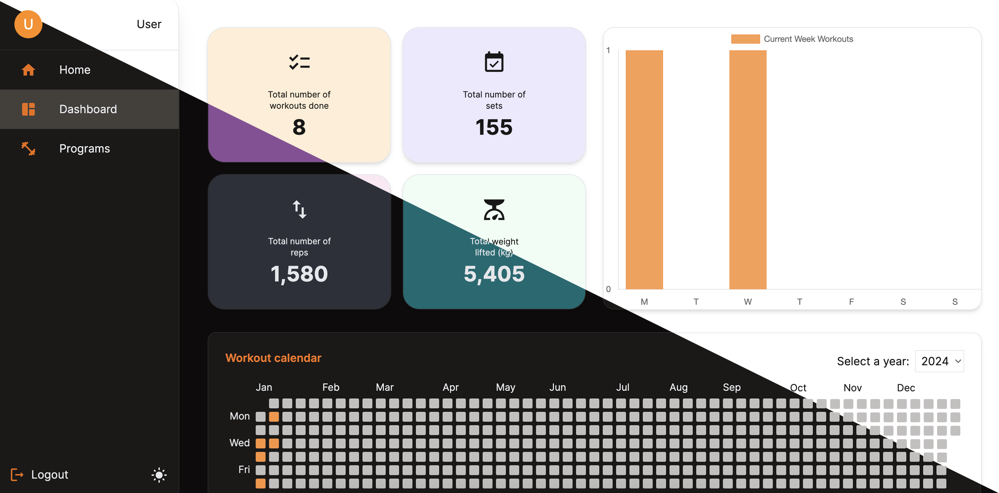

## Workout Tracker



Workout Tracker is a fullstack application designed to help users keep track of their workouts. It utilizes NestJS on the backend, PostgreSQL as the database, and React on the frontend.

### Prerequisites

Before you begin, ensure you have the following software installed:

- [Node.js](https://nodejs.org/) (v20 or later)

## 📝 Usage

Follow these steps to set up the application locally:

1. Clone the repository:

   ```bash
   git clone https://github.com/Marko1310/workoutTracker
   ```

2. Install dependencies in the main folder, frontend, and backend:

   ```bash
   cd workout-tracker
   npm install

   cd workoutTracker/frontend
   npm install

   cd ../backend
   npm install
   ```

3. Create .env files:
   In both frontend and backend folder, create a .env file with the required fields as mentioned in .env.example.

4. Generate and run database migrations

   ```bash
   cd ../backend
   npm run typeorm:generate-migration
   npm run typeorm:run-migrations
   ```

5. In the main folder, run the development server to start the app:
   ```bash
   npm run dev
   ```

# 👨‍💻 Tech stack

- **NestJS (Backend):**
  NestJS is used for building the backend of the application. It is a powerful, extensible framework for building scalable and maintainable server-side applications using TypeScript.

- **PostgreSQL (Database):**
  PostgreSQL is the chosen relational database management system (RDBMS) to store and manage workout program, workout, exercise, and user data.

- **React (Frontend):**
  The frontend is built using React, a popular JavaScript library for building user interfaces. React enables the creation of dynamic and responsive user interfaces for an enhanced user experience.

- **Authentication with JWT**
  The app implements JSON Web Token (JWT) for authentication. User authentication is handled securely, allowing users to log in and access their personalized workout data.

- **Authorization with Casl**
  Casl is used for fine-grained access control and authorization. It helps manage permissions based on roles and ensures that users have the necessary permissions to perform specific actions.

- **Validation with Zod**
  Zod is employed for data validation. It ensures that input data adheres to the specified schema, enhancing the overall robustness and reliability of the application.

- **React Query**
  React Query is utilized to manage state and handle data fetching seamlessly. It provides a powerful set of tools for managing and caching API data in a React application.

- **React Reducer**
  React Reducer is employed to manage state on the client-side. It enables efficient state management and facilitates the handling of complex application states.

- **Tailwind**
  Tailwind CSS is used for styling the frontend components. It provides a utility-first approach to styling, making it easy to create responsive and visually appealing user interfaces.

- **Material-UI (MUI)**
  Material-UI is integrated to enhance the UI with pre-built React components following the Material Design principles. It provides a consistent and visually pleasing user experience.

## 🚀 Features

- **Create Multiple Workout Programs:**
  Users can create and manage multiple workout programs, each tailored to their fitness goals.

- **Create Multiple Workouts per Program:**
  Within each workout program, users have the flexibility to create and organize multiple workouts, allowing for a diverse and dynamic training routine.

- **Create Exercises for Each Workout:**
  Users can add various exercises to each workout, specifying the details of each exercise such as type, sets, and reps.

- **Log Sets and Reps:**
  For each workout, users can log the details of their sets and reps, keeping a comprehensive record of their training sessions. Users can visually track their progress and achievements comparing current workout stats to previous ones, highlighting personal records (PRs).

- **Dashboard with Workout Stats:**
  A personalized dashboard provides users with a quick overview of their progress, showcasing stats such as total reps, total weight lifted, and a calendar highlighting completed workouts.

- **Progress Tracking:**
  Users can visually track their progress and achievements. The dashboard includes features like comparing current workout stats to previous ones, highlighting personal records (PRs).

## ✍️ Contributing

Contributions are welcome! Feel free to open issues or submit pull requests to improve the application.
